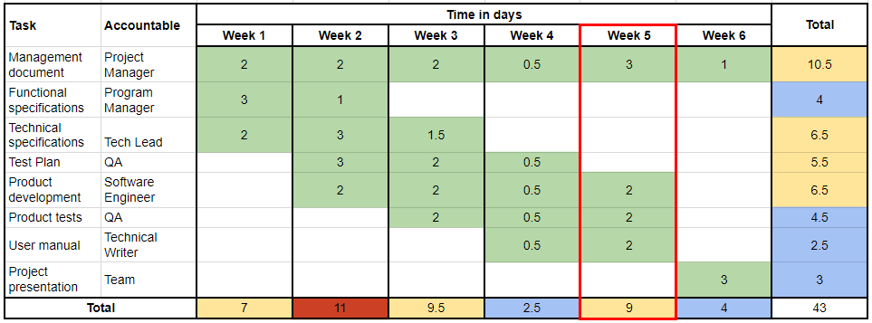
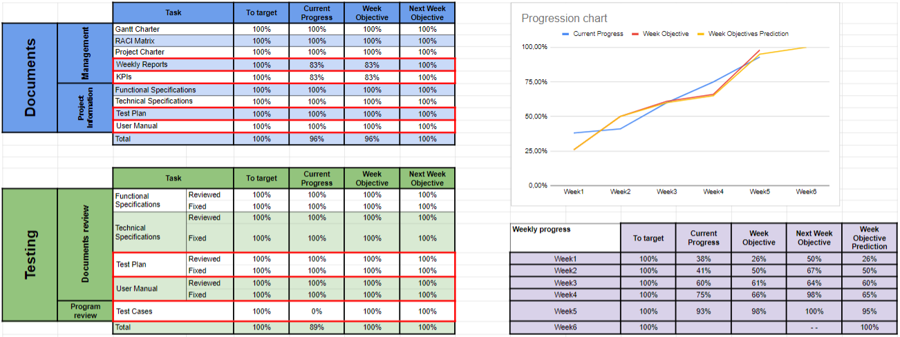

²# Weekly Report 1 - 03/11/24 - 03/17/24

## Project Overview and Summary

 - <b>Project Name:</b> Sportshield
 - <b>Project Manger:</b> Evan UHRING
 - <b>Working time:</b> 3,5h

## Project Organization

This is used from the [Gantt Charter](../gantt-charter.pdf) of the project.

##### The current week is highlighted in red.

## Project KPIs

The current progress of the project and our prevision on the next week.

##### The ongoing tasks are highlighted in red.

## Project Risks

| Risk or Issue | Description | Owner | Status |
| -- | -- | -- | -- |
| Risk 1 | Our Software Engineer will not be back again | Gaël | Ongoing |

## Team Feedback

--